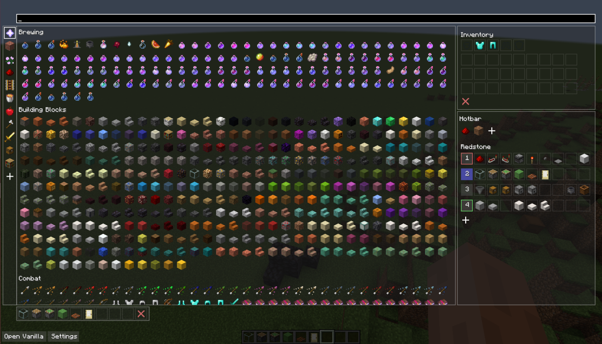
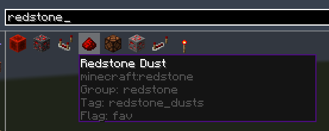

# RefinedCreativeInventory

RefinedCreativeInventory (RCI) is an advanced creative inventory mod for minecraft. It aims to completely replace the creative inventory screen as well as add many new features to it.

Feel free to join the [discord](https://discord.gg/WnaE3uZxDA) if you have any questions!

This mod **requires [DarkKore](https://github.com/DarkKronicle/DarkKore)**

## Features

*When in doubt, right click on something to see if you can configure it more!

### Hotbars

RCI completely overhauls the vanilla saved hotbars. You can add as many saved hotbars, and you can add profiles to store those hotbars. 

In a profile you can shift right click and shift left click to choose two main hotbars. (They will appear green and red when this happens). Hitting `X` will switch between them whenever. You can also you use the `UP`/`DOWN` arrow keys to switch between hotbars in the profile.

To configure the hotbars you can simply drag and drop items into the GUI and use the plus icons to add hotbars. To delete one right click on it.

### Custom Items

On top of every item in vanilla minecraft (including command blocks!), you can store *any item* you want to in the creative inventory. By default, there are a couple utility items as well as a shulker box with preset armor stands. Simply just right click on any item and a configuration screen will pop up. If the item is custom you will see an option in the top right corner to save the item. This will then cause the item to appear in the `Other` section of the GUI.

### Item Flags

To help improve item discoverability you can set custom flags on items. Right-click on an item, and you will see a `Custom Flags` option. You can set multiple flags if you separate them with comma's. (i.e. `fav,util,redstone`). These work on vanilla and custom items.

Pro-tip: If you don't like an item, put the flag `hidden` on it and it will not be shown in tabs.

### Better search

You can easily search flags, tags, groups, and names with the search bar. Just simply start typing and the search bar will automatically focus. You can search for a custom flag (you can configure these in RCI) with `flag:<flag>`, group (vanilla inventory tab) `group:<group>`, tag `tag:<tag>`, and name `name:<name>` or just start typing the name. 

### Color configuration

Most elements that are colored have an option to change them. Configure the background color, slot outline, and more.

### Custom Tabs

RCI provides support for custom tabs. Right-click an existing tab (that is not inventory, hotbars, or all) and it will open a screen. If basic search is off it uses a Konstruct script that can look confusing. Basic search follows the search described in `Better Search` above. If you're interested in using Konstruct, it provides quite a few benefits, but is a lot more complicated. (Don't worry about using it, and join the [discord](https://discord.gg/WnaE3uZxDA) if you have questions!). 

Konstruct allows for boolean gates and more advanced searching. The default template is `item.group('<tab>') and not(item.flag('hidden'))` (with `<tab>` replaced with the tab name). More information can be found on the Konstruct [wiki](https://darkkronicle.github.io/Konstruct/).

### Advanced Item Hover

View item tags (from servers), item group (vanilla tab), and custom tags set.

## Images

